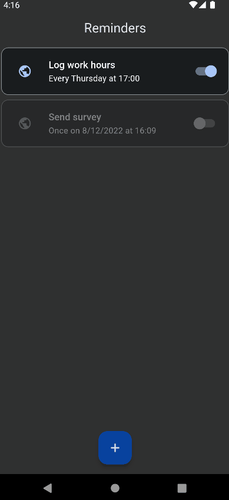

    

# RemindMe 
 

A simple Flutter app to schedule reminder notifications with custom callbacks.

    

## Features
* Open a URL on tapping notification
* Schedule a notification to go off at a specified time
* Repeat notification schedules daily, weekly, monthly, or yearly
* All simple CRUD operations
* Dynamic Material 3 color theming, including dark/light modes

## Running
Pull the repo and then run `flutter pub get` in the directory.
To run the app, run `flutter run ./lib/main.dart` in the directory.
Finally, build with `flutter build`.

## Libraries and Tools
Android icons generated with [Icons Launcher](https://romannurik.github.io/AndroidAssetStudio/icons-launcher.html) and other icons generated with [Flutter Launcher Icons](https://pub.dev/packages/flutter_launcher_icons). Makes heavy use of the [Awesome Notifications](https://pub.dev/packages/awesome_notifications) package for notifications and [bloc](https://bloclibrary.dev/#/) for state management.
